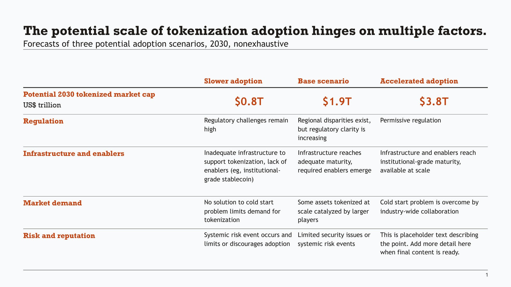
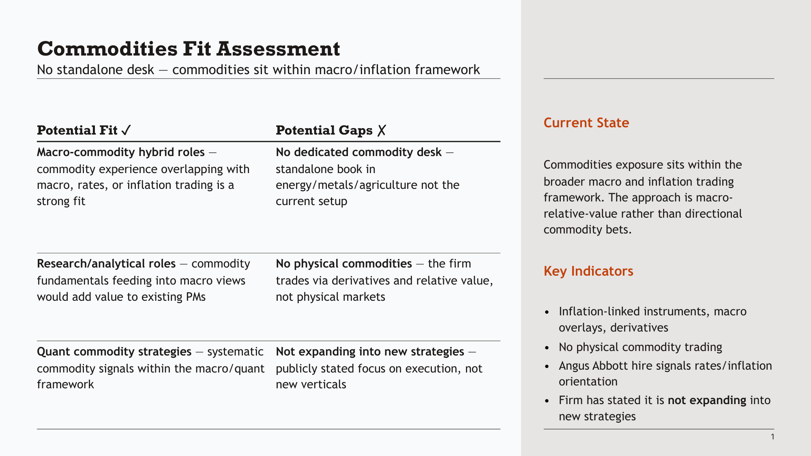

# Clean Slides

An opinionated CLI for AI agents to generate consulting-style PowerPoint slides from YAML. Not a general-purpose slide builder. It produces the kind of minimal, information-dense tables I preferred to write at McKinsey: no graphics, no effects, just structured thinking in a clear, visual format.

Here are two examples, neither touched by me:




## What it does

Your agent writes a YAML spec describing a table's content and structure. Clean Slides handles the layout — column widths, row heights, font sizing, dividers, bullet hierarchy — and produces a `.pptx` file that looks like it was built by hand.

```yaml
title: The potential scale of tokenization adoption hinges on multiple factors.
subtitle: Forecasts of three potential adoption scenarios, 2030, nonexhaustive

table:
  rows: 6
  cols: 4
  has_col_header: true
  has_row_header: true
  col_headers: ["Slower adoption", "Base scenario", "Accelerated adoption"]
  col_header_color: accent1
  column_widths: [0, 1, 1, 1]  # custom weights (remove for html-4 style default)

  row_headers:
    - - { text: "Potential 2030 tokenized market cap" }
      - { text: "US$ trillion", color: tx1, bold: false }
    - "Regulation"
    - "Infrastructure and enablers"
    - "Market demand"
    - "Risk and reputation"

  row_overrides:
    0:
      align: ctr
      anchor: ctr
      bold: true
      color: accent1
      size: 20

  cells:
    - ["$0.8T", "$1.9T", "$3.8T"]
    - ["Regulatory challenges remain high", "Regional disparities exist, but regulatory clarity is increasing", "Permissive regulation"]
    - ["Inadequate infrastructure to support tokenization, lack of enablers (eg, institutional-grade stablecoin)", "Infrastructure reaches adequate maturity, required enablers emerge", "Infrastructure and enablers reach institutional-grade maturity, available at scale"]
    - ["No solution to cold start problem limits demand for tokenization", "Some assets tokenized at scale catalyzed by larger players", "Cold start problem is overcome by industry-wide collaboration"]
    - ["Systemic risk event occurs and limits or discourages adoption", "Limited security issues or systemic risk events", ""]
```

```bash
pptx generate tokenization.yaml -o tokenization.pptx
```

That's mostly it. The tool also handles:

- **Inline formatting** — `**bold**`, `*italic*`, `[links](url)` in any cell
- **Bullet hierarchy** — nested paragraphs with configurable indent levels
- **Icon indicators** — traffic-light circles for RAG status, severity, etc.
- **Sidebars** — split layouts (2/3, 3/4) with formatted text in the secondary area
- **Slide inspection and editing** — read shapes, edit text, merge decks

## What it doesn't do

This is a **text table tool**, not a presentation platform. It won't:

- Generate charts, diagrams, or images
- Apply transitions or animations
- Create freeform layouts or infographics
- Auto-generate content — you think the thoughts, the agent helps you structure them and handles formatting

The design is deliberately constrained. Tables are the primary medium because a table is the minimal way to express structured thinking. Even the default bullet style at level zero is _no bullet_ — because bullets add visual clutter that doesn't serve the reader.

If you want a tool that produces polished decks with graphics and imagery, this isn't it. If you want something that takes structured text and produces clean, consistent, professional-looking table slides — fast — this is what it's for.

## Template

- **Quick start:** works out-of-the-box with the bundled [example template](clean_slides/example-template/) (and see a fun one-shotted deck about the adorable Russian Desman [here](examples/custom-template/vykhukhol.pptx))
- **BYO:** load your own template by dropping it in `.clean-slides/template.pptx` and [creating the config](docs/TEMPLATE-CONFIG.md)

## Quick Start

```bash
git clone https://github.com/tmustier/clean-slides && cd clean-slides
pip install -e .
pptx init           # creates .clean-slides/ with a bundled example template
```

Write a YAML file (see example above), then:

```bash
pptx generate slide.yaml -o output.pptx
```

The template and config in `.clean-slides/` are discovered automatically — no flags needed.

## Using your own template

Any `.pptx` works as a template — a corporate deck, a downloaded theme, or something you design.

```bash
# Initialise with your template (auto-generates a starter config)
pptx init -t my-template.pptx

# Or do it manually
pptx init-config my-template.pptx -o config.yaml   # inspect + generate config
mkdir .clean-slides
cp my-template.pptx .clean-slides/template.pptx
cp config.yaml .clean-slides/config.yaml
```

Then edit `.clean-slides/config.yaml` to map your template's colours, fonts, and placeholder indices. See [docs/TEMPLATE-CONFIG.md](docs/TEMPLATE-CONFIG.md) for the full reference, and [examples/custom-template/](examples/custom-template/) for a worked example.

## Commands

| Command | Purpose |
|---------|---------|
| `pptx generate <yaml...>` | Generate slides from YAML specs |
| `pptx validate <yaml...>` | Check YAML against schema |
| `pptx verify <yaml...>` | Check sizing and overflow |
| `pptx show <file> [slide] [shape]` | Inspect slides and shapes |
| `pptx layouts <file>` | Show template layouts and content areas |
| `pptx theme <file>` | Show colour scheme |
| `pptx edit <file> <slide> <shape> <text>` | Edit shape text |
| `pptx insert <deck> <source>` | Merge slides from another file |
| `pptx render <file> <slide>` | Render to PNG |
| `pptx init [-t template]` | Bootstrap a `.clean-slides/` project |
| `pptx init-config <template>` | Generate config from a template |

Full YAML schema: [docs/INPUT-SCHEMA.md](docs/INPUT-SCHEMA.md)

## Development

```bash
pip install -e '.[dev]'
pre-commit install
python -m pytest -q
pyright clean_slides/
```

## Why this exists

I spent six years writing slides in consulting. Most AI slide tools focus on imagery and visual polish — which has its place, but isn't what makes a consulting slide useful. A good slide is a unit of structured argumentation that happens to be visual. You figure out the narrative first, decompose it into pages, then fill each page with the component parts of your argument.

This tool takes that workflow seriously. You focus on the content and structure; it handles the formatting. When used with an AI agent, it produces first drafts that feel like they belong in the document — consistent style, proper hierarchy, no "generated by AI" aesthetic. The constraint is the point.

More on the design philosophy: [thomasmustier.com/projects/clean-slides](https://thomasmustier.com/projects/clean-slides)

Clean Slides works with any agent, but I use [pi.dev](https://pi.dev) with my [Agent Teams](https://github.com/tmustier/pi-agent-teams) extension that lets the agent create clones of itself with the same context and manage them — so each clone worked on one page with full context, and the original agent focused on output quality and consistency, similar to how a consulting team would split work after a group problem-solving meeting. You can optionally do this with:

```bash
npm install -g @mariozechner/pi-coding-agent
pi install npm:@tmustier/pi-agent-teams
```
